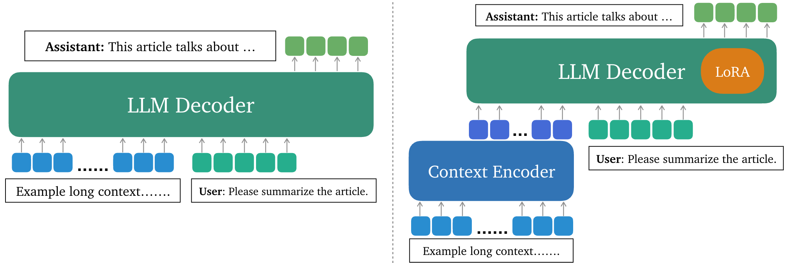

# LLoCO: Learning Long Contexts Offline
### [Paper](https://arxiv.org/abs/2404.07979)

LLoCO is a technique that learns documents offline through context compression and in-domain parameter-efficient finetuning using LoRA, which enables LLMs to handle long context efficiently.



## Getting Started
### Installation
Setup a new environment and run: 
```bash
pip install -r requirements.txt
```

### Download Datasets (Optional)
Use the following command to download the [QuALITY](https://github.com/nyu-mll/quality) dataset. Other datasets are loaded from HuggingFace and can be downloaded automatically during data loading.

```bash
cd data
wget https://raw.githubusercontent.com/nyu-mll/quality/main/data/v1.0.1/QuALITY.v1.0.1.htmlstripped.train
wget https://raw.githubusercontent.com/nyu-mll/quality/main/data/v1.0.1/QuALITY.v1.0.1.htmlstripped.dev
```

### Preprocess Summary Embeddings
First generate summary embeddings for the datasets. An example bash script is stored in `scripts/preproc_emb.sh`, which preprocess the training dataset of QuALITY:
```bash
python3 preproc_embs.py \
    --emb_model_name "autocomp" \
    --dataset quality \
    --split train \
    --data_path ./data/QuALITY.v1.0.1.htmlstripped.train \
    --out_path ./embeddings/quality_train_embs.pth \
    --truncation False \
```
This script will generate summary embeddings for QuALITY training set, and store the embeddings in the `/embeddings` folder. Embedding generation for other datasets works similarly. 

### Finetune
Here is an example bash script to finetune the QuALITY dataset. This script is in `scripts/finetune_quality.sh`. 
```bash
torchrun --nproc_per_node=4 finetune_quality.py  \
        --output_dir output/lloco_quality \
        --run_name lloco_quality \
        --data_path ./data/QuALITY.v1.0.1.htmlstripped.train \
        --embedding_path ./embeddings/quality_train_embs.pth \
        ...
```

### Inference & Evaluation
Below is a bash script to run inference over the validation sets are contained in `script/inference.sh`. Evaluation results are stored in `out_path`, and the finetuned model is specified by `peft_model`. 
```bash
python3 inference.py  \
    --model_name_or_path meta-llama/Llama-2-7b-chat-hf \
    --dataset_name qmsum \
    --eval_mode autocomp \
    --out_path ./eval/qmsum_lloco.json \
    --peft_model output/lloco_qmsum  \
    --embedding_path ./embeddings/qmsum_val_embs.pth \
    ...
```

After obtaining the prediction files, use the following evaluation scripts in the /eval folder to get the scores for each dataset.

**Evaluate QuALITY**:
```bash
python3 quality_evaluator.py --quality_path {quality_path} --pred_path {prediction_file}
```

**Evaluate QMSum, Qasper, NarrativeQA**:
```bash
python3 scroll_evaluator.py --split validation --dataset_name {dataset_name} --predictions {prediction_file} --metrics_output_dir .
```

**Evaluate HotpotQA**:
```bash
python3 hotpot_evaluator.py --pred_path {prediction_fild}
```

## TODOs

- [x] Release finetuning and inference code.
- [ ] Release pre-trained LoRA weights on HuggingFace.
- [ ] Integrate to [VLLM](https://github.com/vllm-project/vllm).

## Citation
If you find LLoCO useful or relevant to your project and research, please kindly cite our paper:
```bibtex
@article{tan2024lloco,
  title   = {LLoCO: Learning Long Contexts Offline},
  author  = {Sijun Tan and Xiuyu Li and Shishir Patil and Ziyang Wu and Tianjun Zhang and Kurt Keutzer and Joseph E. Gonzalez and Raluca Ada Popa},
  year    = {2024},
  journal = {arXiv preprint arXiv: 2404.07979}
}
```

## Acknowledgements
We referred to [AutoCompressors](https://github.com/princeton-nlp/AutoCompressors) for the context encoder implementation.
